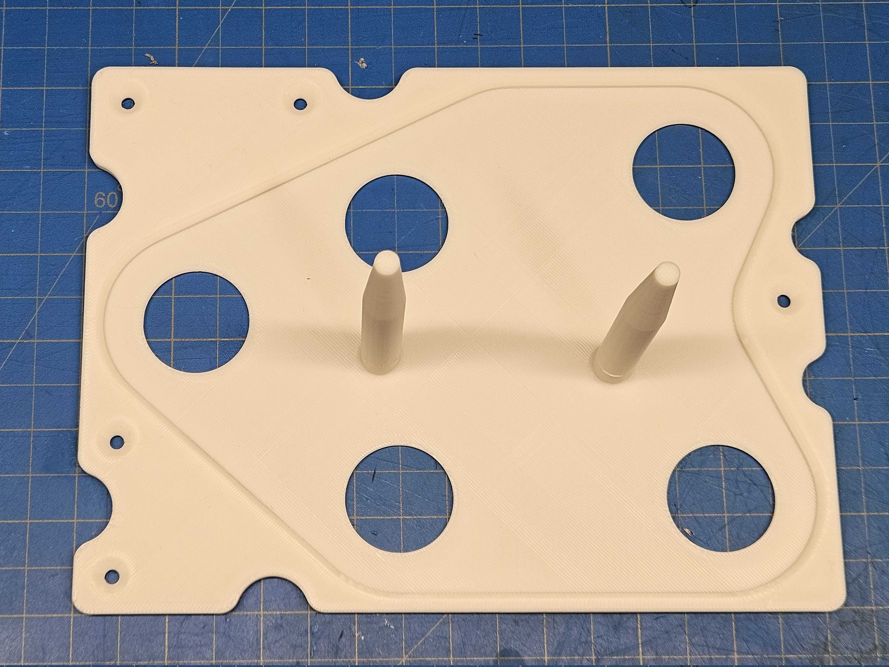
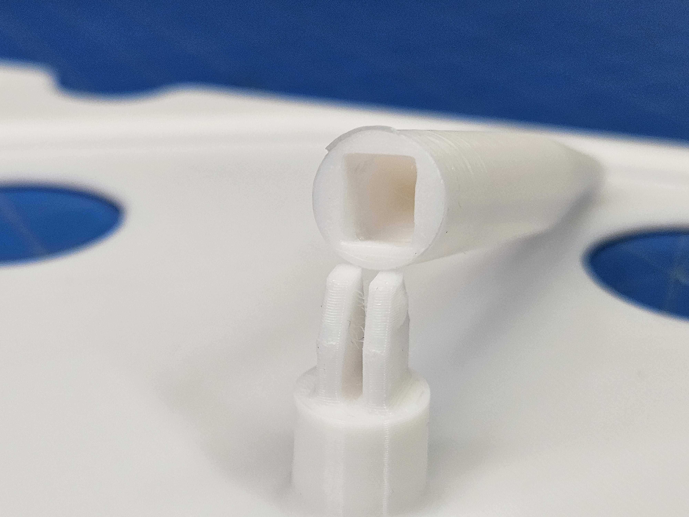
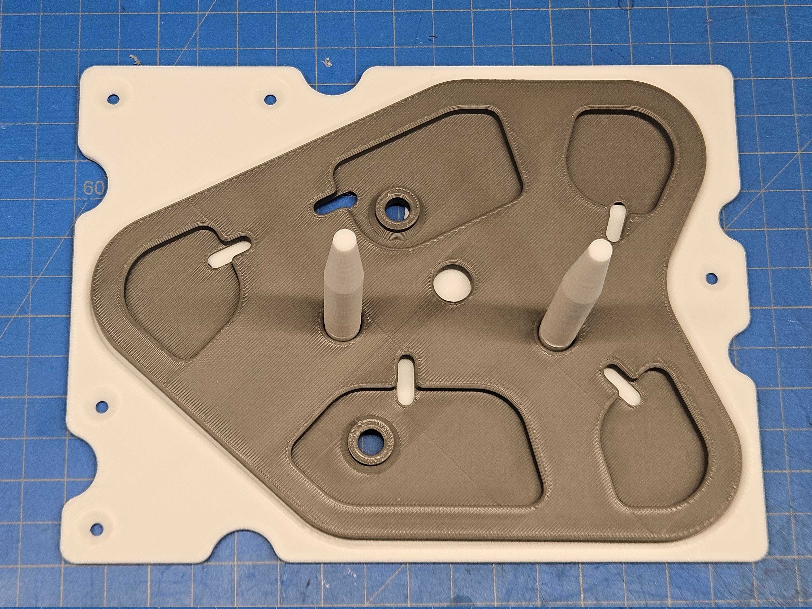

# factory_sim 3d printing assets

The `factory_sim` example workspace models a small factory environment. The ["Pick and Place Brackets from Left Bin"](https://github.com/PickNikRobotics/moveit_pro_example_ws/blob/main/src/factory_sim/objectives/pick_and_place_brackets_from_left_bin.xml) models an automotive-like bracket part for the robot to pick, place on a jig, and the deposit into a bin.

In order to test this on robot hardware, several parts need to be 3d printed. These files are saved as 3mf files as that is the new standard mesh file in 3d printing and does a better job preserving properties of the model than STLs.

## Bracket Part

This simulated automotive bracket can be found in [`3mf/pick_and_place_bracket_part.3mf`](3mf/pick_and_place_bracket_part.3mf)
It was printed on a Bambu Labs X1 Carbon out of PLA with a 0.4 mm nozzle with 15% infill and 2 perimeters, which are the default settings for that machine. As this part isn't expected to incur heavy loads, no special settings should be required.

The part was designed to be picked with a vacuum gripper using a 20 mm diameter nozzle, but other nozzle diameters may work as there are many flat areas that could be picked.

## Bracket Jig
The simulated bracket jig is modelled as two tapered posts. Unfortunately, the real world does now allow us to spawn tapered posts anywhere in the world, so we are required to model more geometry than that 😅.  

The jig has two 11 mm diameter tapered posts, that are spaced 65 mm apart from each other on center.
It is modelled as three parts: a base and two posts, to make it easier to print and change the height of the posts if needed.  

- [`3mf/pick_and_place_bracket_jig_base.3mf`](3mf/pick_and_place_bracket_jig_base.3mf)
- [`3mf/pick_and_place_bracket_jig_post.3mf`](3mf/pick_and_place_bracket_jig_post.3mf)  

The jig base was printed on a Bambu Labs X1 Carbon out of PLA with a 0.4 mm nozzle with 15% infill and 2 perimeters, but the posts should be printed using 6 perimeters and a brim to increase strength as they are oriented vertically on the build plate. During testing, using these settings produced a strong result.  

> [!NOTE]  
> The bracket jig base contains a number of holes and cutouts from the sides. As this is a large flat print warping could occur and these cutouts deter this from happening.

## Assembly
The posts are designed to be a snap fit onto the base but will only fit together in one orientation.  

They shouldn't require too much force to snap together. If they seem to be resisting, try another orientation.

## Mounting
The jig base has five holes that can be used to mount onto a flat surface, using a common, general purpose #2 phillips drive flat head screw. Five screws are not needed to secure the base, but rather 3 of the screws are spaced 50 mm and 100 mm apart to facilitate precise locating on a table.  

## Use
Once assembled, the bracket part should slide easily over the posts and come to rest in the seat of the jig.  

